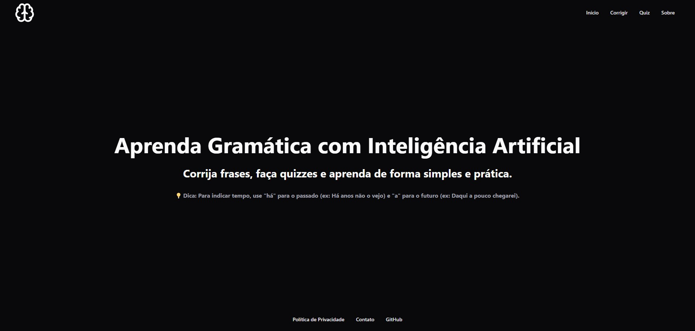
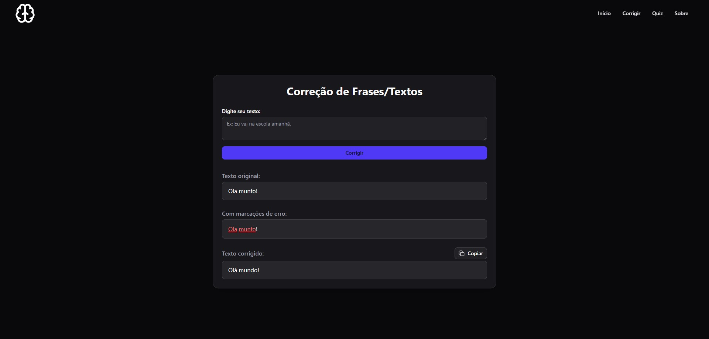

# 📘 Portugenio

O **Portugenio** é um aplicativo web para estudar português, com foco inicial em gramática.  
Ele foi desenvolvido para ajudar estudantes e entusiastas da língua portuguesa a aprender de forma simples, prática e interativa. 🚀

---

## 📸 Capturas de Tela

Aqui estão algumas imagens do projeto:

  



---

## 🛠️ Tecnologias Utilizadas

- ⚛️ React
- 🎨 Tailwind CSS
- 📦 Node.js

---

## 🚀 Como Rodar o Projeto

Clone o repositório e instale as dependências:

```bash
# Clonar o repositório
git clone https://github.com/wolfhackd/PortuGenio

# Entrar na pasta
cd FrontEnd

# Instalar dependências
npm install

#Sair da pasta
cd ..

# Entrar na pasta
cd BackEnd

# Instalar dependências
npm install

# Comandos para rodar a aplicação frontend
npm run dev #Caso queira rodar em desenvolvimento (Lembrar de criar as .env tanto do back quanto do front)
npm run build # Opcional
npm run dev #Opcional (Rodar em produção)

#Atenção Back end já adaptado para subir em produção

# Comandos para rodar a aplicação backend

npm run dev #Rodar Backend
npm run build # Opcional
npm run start # Opcional (Caso queira rodar em produção)
```
